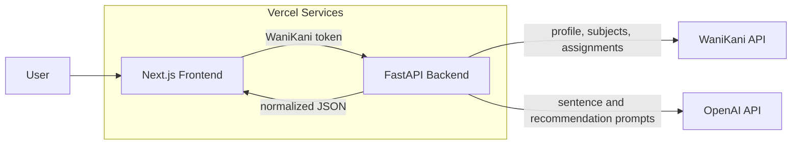
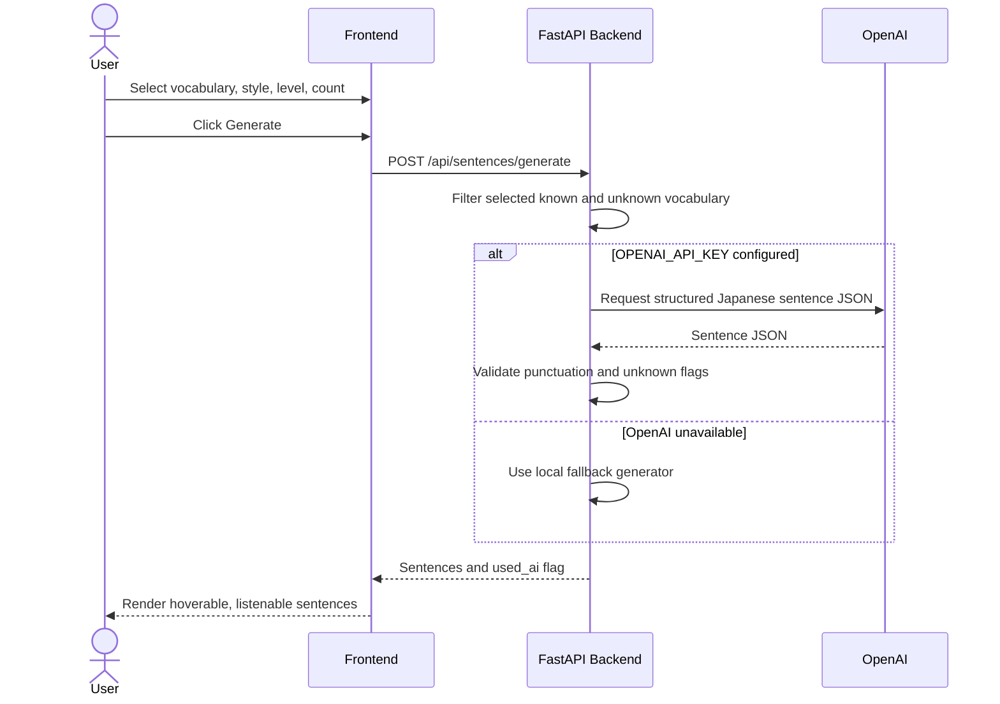
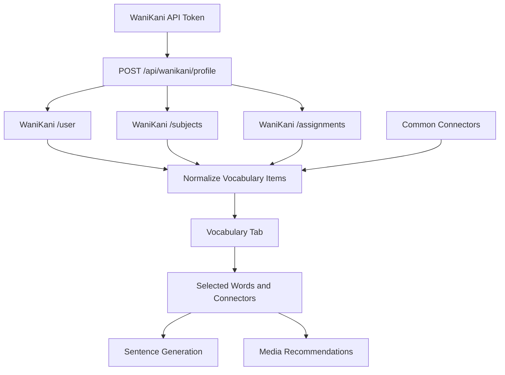
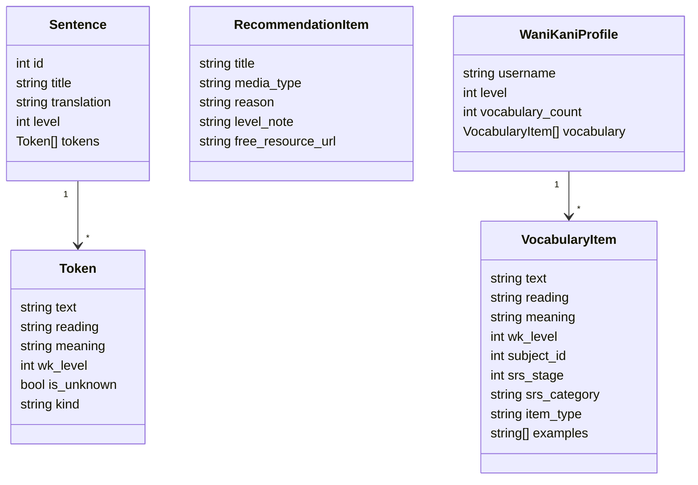
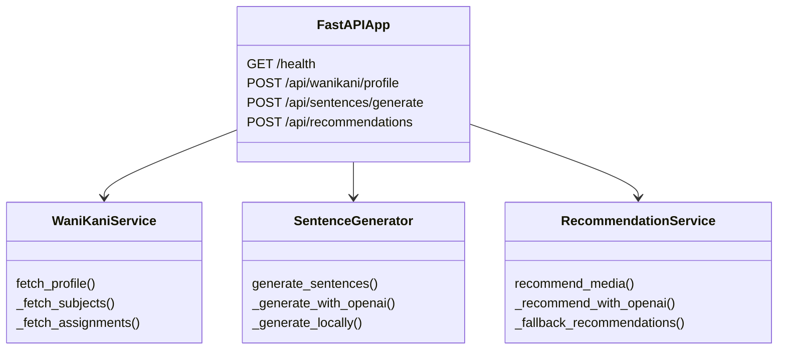
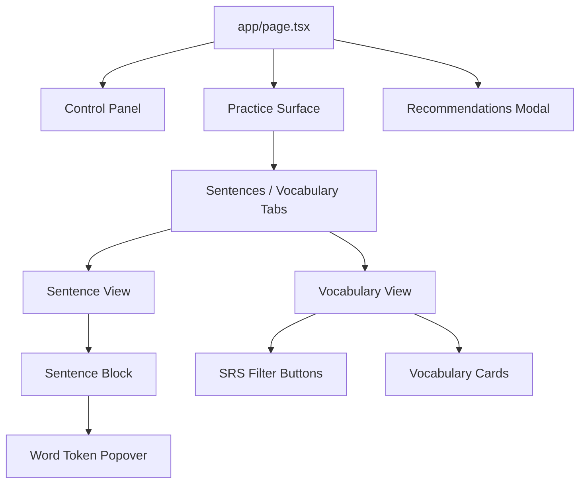

# WaniKani Sentence Generator

Generate Japanese study sentences from your WaniKani vocabulary. The app has a Next.js frontend and a FastAPI backend. The backend retrieves your WaniKani level/vocabulary and can use OpenAI to generate sentences constrained to known vocabulary, with an optional small amount of new vocabulary from up to five WaniKani levels ahead.

## Project Structure

```text
wanikani-generator/
  backend/    FastAPI API, WaniKani integration, sentence generation service
  frontend/   Next.js app for loading vocabulary, generating sentences, and studying
```

## Main Features

- Load your WaniKani profile level and vocabulary from a WaniKani v2 API token.
- Browse vocabulary in a dedicated tab with meanings, readings, SRS stage, and WaniKani example sentences when available.
- Select or clear vocabulary and connectors to control which words can be used for sentence generation.
- Filter the vocabulary list by SRS category and sample a smaller working set.
- Generate multiple Japanese sentences from your available vocabulary.
- Filter generation by maximum WaniKani level.
- Choose sentence style: short, medium, long, or story.
- Optionally include a few unknown words from 0 to 5 WaniKani levels ahead.
- Hover or focus a word to see its English meaning, reading, WaniKani level, and a word-level listen button.
- Listen to the whole sentence with browser speech synthesis.
- Hide sentence translations until requested.
- Show a small unknown-word list only when advanced unknown vocabulary is enabled and actually appears.
- Request book, graded reader, website, anime, or movie recommendations based on the selected vocabulary.

## Quick Start

From the project root, set up dependencies and local env files:

```powershell
npm run setup
```

Then run both apps:

```powershell
npm run dev
```

`npm run setup` creates local env files, creates a backend virtual environment, installs backend dependencies, and installs frontend dependencies.

After setup, put your OpenAI key in `backend/.env`:

```text
OPENAI_API_KEY=your_openai_api_key_here
```

## Backend

The backend lives in `backend/` and exposes:

- `GET /health`
- `POST /api/wanikani/profile`
- `POST /api/sentences/generate`
- `POST /api/recommendations`

The sentence generator uses OpenAI when `OPENAI_API_KEY` is configured. If no key is configured, it falls back to a simple local generator so the UI can still be exercised.

### Backend Setup

```powershell
npm run setup
```

Put your OpenAI key in `backend/.env`:

```text
OPENAI_API_KEY=your_openai_api_key_here
OPENAI_MODEL=gpt-5.2
FRONTEND_ORIGIN=http://localhost:3000
```

Run the backend:

```powershell
npm run dev:backend
```

## Frontend

The frontend lives in `frontend/` and calls the backend at `http://localhost:8000` by default.

Defaults:

- Sentence style: `short`
- Number of generated sentence cards: `5`
- Unknown levels ahead: `0`

The sentence count and unknown-level controls live under Advanced options.

### Frontend Setup

```powershell
npm run dev:frontend
```

If your backend uses another URL, set it in `frontend/.env.local`:

```text
NEXT_PUBLIC_API_BASE_URL=http://localhost:8000
```

Then open `http://localhost:3000`.

## API Keys

- OpenAI API key: write it in `backend/.env` as `OPENAI_API_KEY`.
- WaniKani API token: enter it in the frontend input. The browser sends it to the local FastAPI backend to fetch your WaniKani profile and vocabulary.

For a production deployment, move WaniKani token handling to a real authentication/session flow instead of sending raw tokens from the browser.

## Diagrams

These diagrams are here for readers who want the implementation details after the quick overview and setup instructions.

- [System Architecture](#system-architecture)
- [Sentence Generation Flow](#sentence-generation-flow)
- [Vocabulary Data Flow](#vocabulary-data-flow)
- [Domain Model](#domain-model)
- [Backend Services](#backend-services)
- [Frontend Component Tree](#frontend-component-tree)

### System Architecture



### Sentence Generation Flow



### Vocabulary Data Flow



### Domain Model



### Backend Services



### Frontend Component Tree



## Vercel Deployment

This repo includes a root `vercel.json` for Vercel Services:

- Frontend service: `frontend/` at `/`
- Backend service: `backend/` at `/_/backend`

In Vercel, import the private GitHub repo as a Services project and keep the detected roots/prefixes.

Set these Vercel environment variables:

```text
OPENAI_API_KEY=your_openai_api_key_here
OPENAI_MODEL=gpt-5.2
FRONTEND_ORIGIN=https://your-vercel-app.vercel.app
NEXT_PUBLIC_API_BASE_URL=/_/backend
```

After the first deploy, replace `FRONTEND_ORIGIN` with the actual Vercel production URL.
